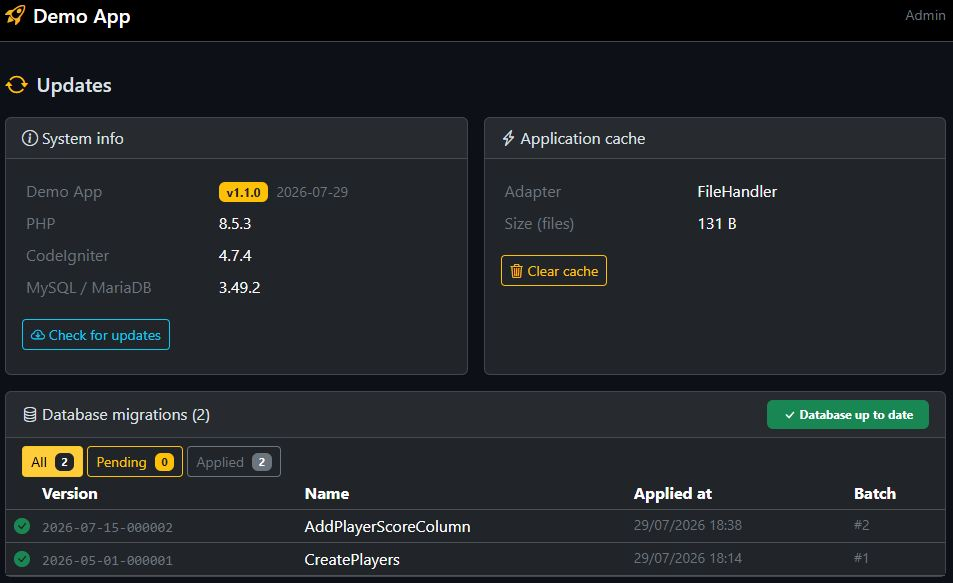
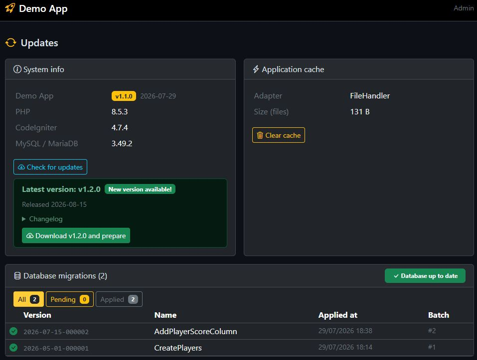
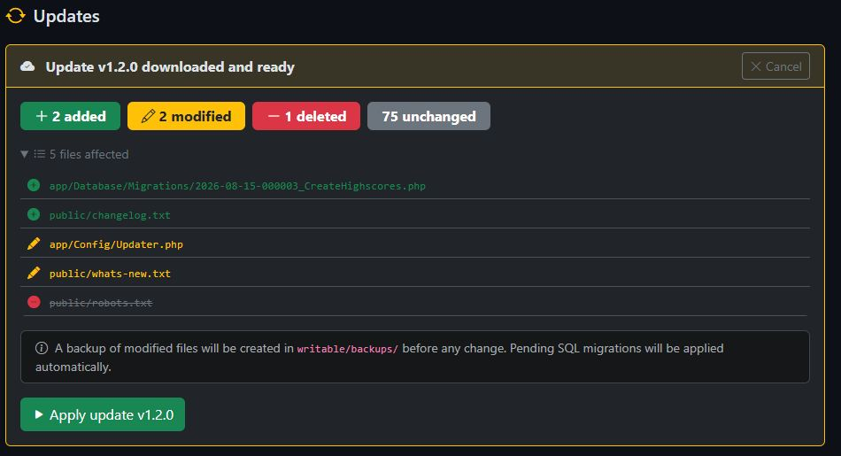
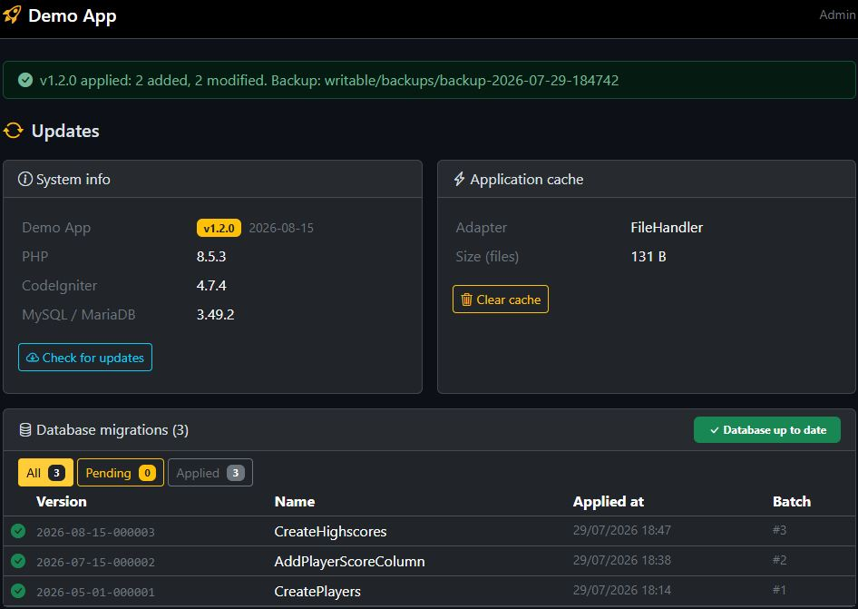

# ci4-updater

[](https://github.com/forgelab-me/ci4-updater/actions/workflows/tests.yml)
[](https://packagist.org/packages/forgelab-me/ci4-updater)
[](LICENSE)

A drop-in self-update system for CodeIgniter 4 apps: an admin panel that
checks a remote update server (or GitHub releases) for new versions,
downloads the release ZIP, diffs it against the live install (SHA-256
manifest), backs up changed files, applies the update, and runs pending DB
migrations — all from the browser, no SSH/git pull required.

Every update leaves a backup the panel restores in one click, and releases can
be signed so a compromised update server can't publish code to your apps.

| | |
|---|---|
|  *Current version, PHP/CI/DB info, migration status* |  *A new release was found* |
|  *File-level diff, before anything is written* |  *Applied, with the DB migration run automatically* |

## Requirements

PHP 8.2+ · `ext-zip` · CodeIgniter 4.4+

## Install

```bash
composer require forgelab-me/ci4-updater
php spark updater:setup
```

`updater:setup` is a one-time step per app. It publishes an editable
`app/Config/Updater.php`, adds `service('updater')->routes($routes);` to
`app/Config/Routes.php`, and creates `writable/updater_settings.json` with the
two keys you have to fill in. Re-running it is safe: existing files are only
replaced after confirmation (or with `-f`), the routes line is added once, and
settings already set are left alone.

The panel itself is rendered from the package, so its improvements arrive with
`composer update`; point `$layout` at your admin layout and set `$appName`.
Pass `--views` if you'd rather own the markup.

Then, at minimum:

1. Set `VERSION`, `DATE` and `USER_AGENT` in `app/Config/Updater.php`.
2. Set `$layout` to your admin layout and `$appName` in the same file.
3. Make sure the route filter really restricts access — **read
   [Security](docs/security.md) first**.
4. Point the app at a feed. Either run:

   ```bash
   php spark updater:config --url https://updates.example.com/api/my-app
   ```

   or edit `writable/updater_settings.json` directly:

   ```json
   {
       "update_server_url": "https://updates.example.com/api/my-app",
       "update_server_token": ""
   }
   ```

   Leave the token empty for a public feed. `updater:config` with no options
   prints what is currently set — the quickest answer to "why does the panel
   say no update server is configured?". See
   [Update server](docs/update-server.md) for what that URL has to serve.

> If your app uses [Shield](https://github.com/codeigniter4/shield), running
> migrations creates a `settings` table — that belongs to
> `codeigniter4/settings`, a Shield dependency, and has nothing to do with this
> package. ci4-updater ships no migrations and creates no tables.

Full details: [Configuration](docs/configuration.md).

## From the command line

The panel is not the only way in — useful over SSH, from a deploy script, and
on the day the panel is what broke.

```bash
php spark updater:check          # what is the server offering?
php spark updater:apply          # download, show the diff, ask, apply
php spark updater:apply --dry-run
php spark updater:apply --yes    # unattended
php spark updater:maintenance    # is a window open? --on / --off to move it
```

`updater:check` reports through its exit code as well: `0` up to date, `2` an
update is available, `1` the check could not be made — so a cron job can act on
it without parsing anything.

```bash
php spark updater:check --quiet || php spark updater:apply --yes
```

`updater:apply` refuses to start when signatures are required and the public
key cannot be read, backs up every file it overwrites, runs pending migrations,
and prunes old backups — the same steps, in the same order, as the panel.
Restoring a backup stays a panel action.

## While an update writes

Applying a release is not atomic. Register the filter and requests get a 503
for the seconds it takes, instead of a tree that is half one version:

```php
// app/Config/Filters.php
public array $aliases = [
    'maintenance' => \Forgelabme\Ci4Updater\Filters\Maintenance::class,
];

public array $globals = [
    'before' => [
        'maintenance' => ['except' => ['admin/updates', 'admin/updates/*']],
    ],
];
```

Exempt the panel, as above: it is what you need when something has to be rolled
back. The window closes when the writing ends, and expires on its own after
`Config\Updater::$maintenanceTtl` seconds if an update never gets that far.

## Security

These routes can overwrite any file under `app/`/`public/` and run DB
migrations. Treat them as deploy access, not as an ordinary admin page: the
filter you pass to `routes()` is the entire boundary, so gate it on an
admin-only group or permission rather than "is logged in", and serve
`update_server_url` over HTTPS only — everything it returns gets written over
your application files.

The manifest's SHA-256 check catches a corrupted download, **not** a
malicious server — it comes from that same server. To close that gap, sign
your releases: set `Config\Updater::$publicKeys` and unsigned releases are
refused from then on. See [Signing releases](docs/signing.md) and
[Security](docs/security.md).

## How it works

1. Before cutting a release you run `php spark update:manifest`. It hashes
   every file in `SCAN_DIRS` (SHA-256), writes `manifest.json` — recording
   which directories the release covers, and what it needs to run, read from
   `composer.json` — and bundles a `release_X.Y.Z_*.zip` with the manifest
   embedded.
2. You publish that ZIP and a `latest.json` describing it —
   [`ci4-update-server`](https://github.com/forgelab-me/ci4-update-server) is
   a ready-made server for this, or use GitHub Releases.
3. In the app, `/admin/updates` checks the feed, downloads and diffs the
   release, and applies it on confirmation — backing up every changed file to
   `writable/backups/` and running pending migrations. `php spark
   updater:apply` does the same thing from a shell.
4. If it goes wrong, the same panel restores that backup: files go back as
   they were and files the update added are removed. Older backups are pruned
   automatically (`$keepBackups`, five by default). A restore reverts code and
   never the database — the panel flags backups whose update shipped
   migrations.

A release covers `app/` and `public/` by default and says so in its manifest,
so an app only ever touches what a release actually declares. Dependencies can
be shipped too — see
[Shipping vendor/](docs/configuration.md#shipping-vendor).

Step by step: [Releasing an update](docs/releasing.md).

## Documentation

- [Configuration](docs/configuration.md) — config reference, routes, custom
  settings storage, permissions
- [Update server](docs/update-server.md) — the `latest.json` contract, your
  own server or GitHub Releases
- [Security](docs/security.md) — trust model, filters, recovery
- [Signing releases](docs/signing.md) — optional signature verification,
  off by default
- [Releasing an update](docs/releasing.md) — release workflow and the full
  update pipeline

## Contributing

Issues and PRs are welcome.

```bash
composer install
composer test
composer validate --strict
```

Keep changes focused, add or update tests for behavior changes, and note
anything user-facing in [CHANGELOG.md](CHANGELOG.md).

## License

MIT — see [LICENSE](LICENSE).
